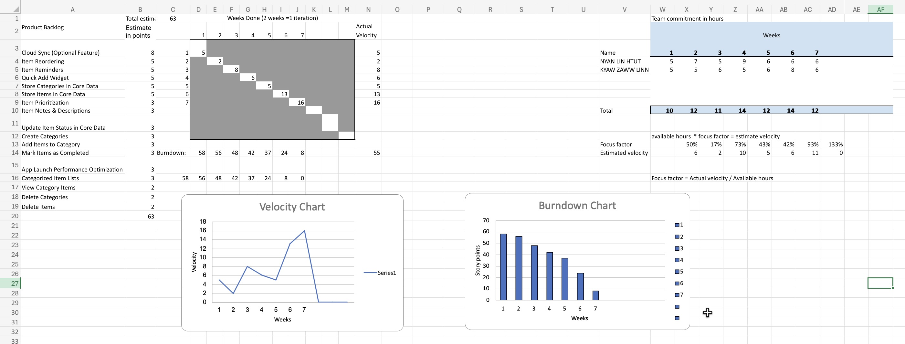
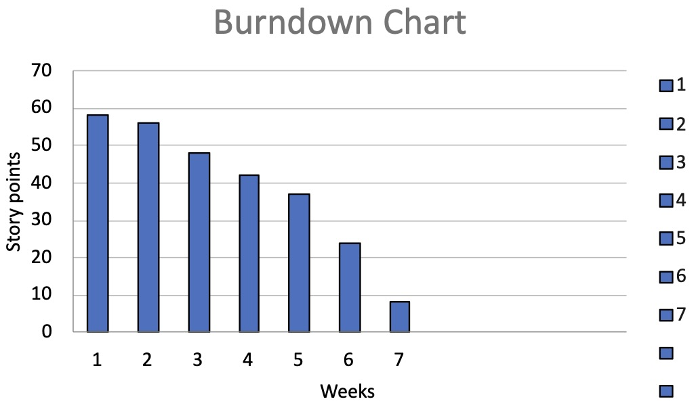
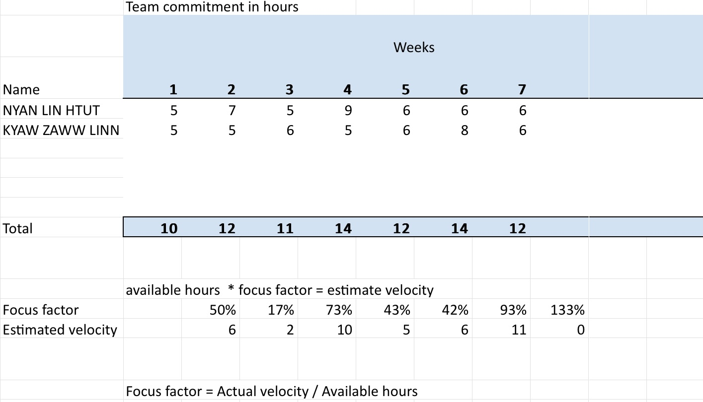
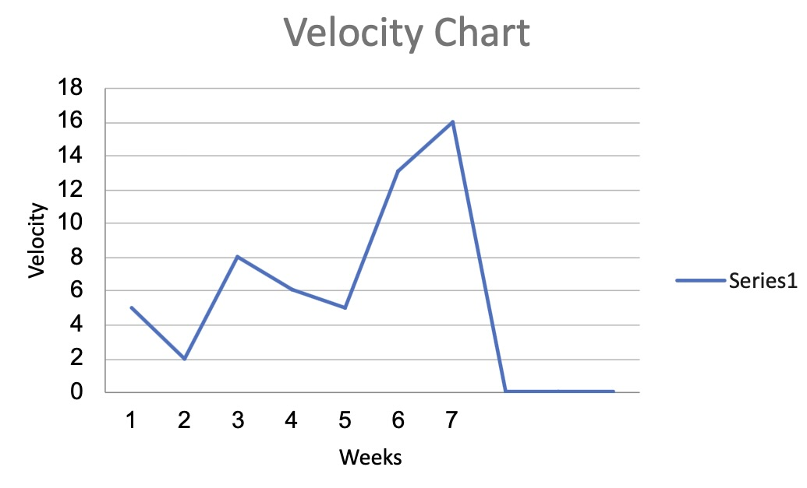
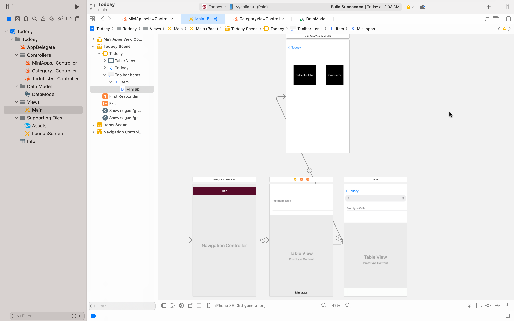
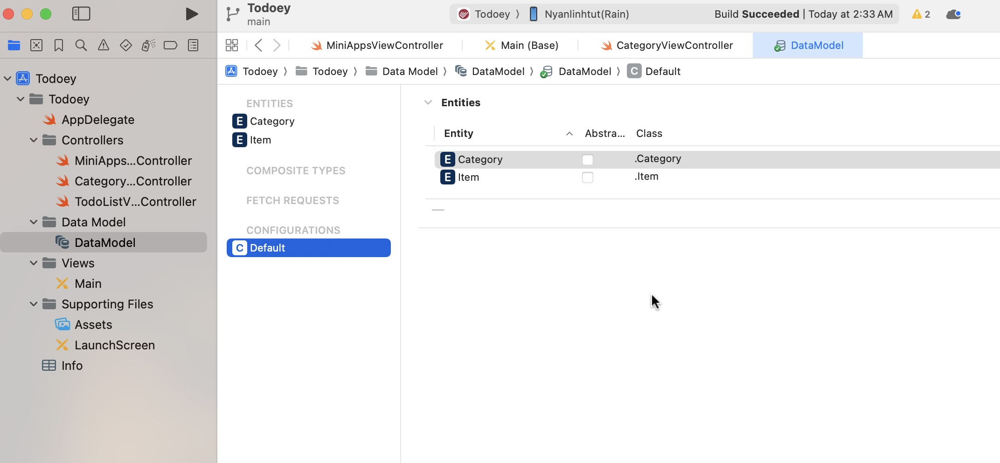
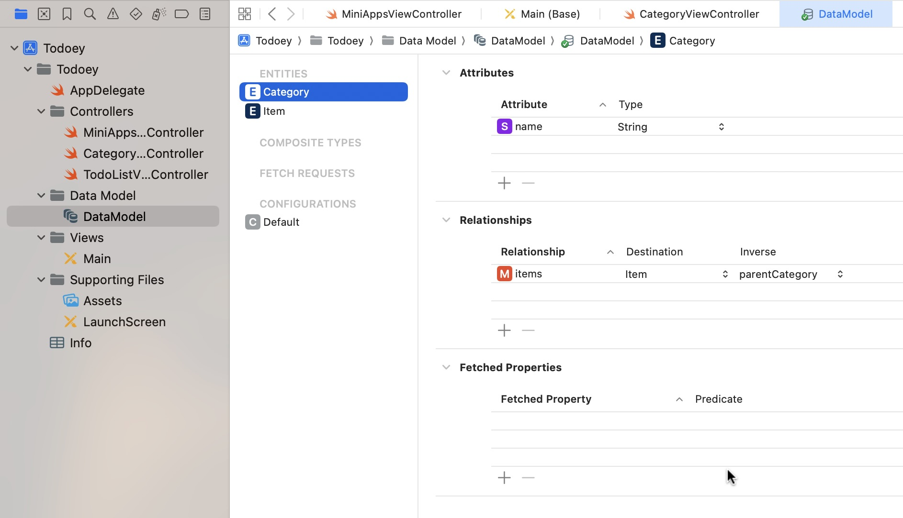
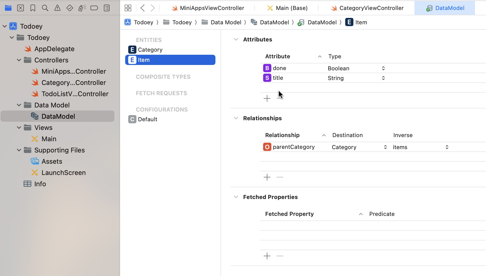

# Main Report for Todoey App Development

## Introduction
Todoey is a task management app designed to help users efficiently organize their daily tasks and activities. It allows users to create, manage, and prioritize their to-dos by categorizing them into customizable lists. The app features essential functionality such as adding, deleting, and marking tasks as completed. Additionally, advanced features like prioritization, reminders, and task reordering are included to improve task management. Todoey is developed for anyone looking to stay organized, ranging from students to professionals. With a clean, simple interface and powerful functionality, Todoey makes managing tasks easier and more intuitive.

## User Stories

### Iteration 1: Basic Todo List Features
1. **Create Categories**  
   *As a user, I want to create multiple categories so that I can organize my tasks efficiently.*  
   - **Estimation**: 3 points

2. **Delete Categories**  
   *As a user, I want to delete categories by swiping so that I can remove unnecessary lists.*  
   - **Estimation**: 2 points

3. **View Category Items**  
   *As a user, I want to tap a category to view its items so that I can manage my tasks within that category.*  
   - **Estimation**: 2 points

4. **Add Items to Category**  
   *As a user, I want to add items to a category using a + button so that I can list my tasks.*  
   - **Estimation**: 3 points

5. **Delete Items**  
   *As a user, I want to swipe and delete items so that I can remove tasks I no longer need.*  
   - **Estimation**: 2 points

6. **Mark Items as Completed**  
   *As a user, I want to tick an item to mark it as completed so that I can track finished tasks.*  
   - **Estimation**: 3 points

### Iteration 2: Advanced Item Management (Bullshit Edition)
1. **Categorized Item Lists**  
   *As a user, I want my item lists to be neatly arranged under categories so that I can find my tasks without effort.*  
   - **Estimation**: 3 points

2. **Item Prioritization**  
   *As a user, I want to set priority levels (High, Medium, Low) for my items so that I know which tasks are urgent.*  
   - **Estimation**: 3 points

3. **Item Reordering**  
   *As a user, I want to drag and reorder my items in a category so that I can organize them based on importance.*  
   - **Estimation**: 5 points

4. **Item Notes & Descriptions**  
   *As a user, I want to add additional notes or descriptions to my items so that I can provide more context.*  
   - **Estimation**: 3 points

5. **Item Reminders**  
   *As a user, I want to set reminders for my items so that I get notified before deadlines.*  
   - **Estimation**: 5 points

6. **Quick Add Widget**  
   *As a user, I want a quick add feature on my home screen so that I can add tasks without opening the app.*  
   - **Estimation**: 5 points

### Iteration 3: Core Data & Performance Enhancements
1. **Store Categories in Core Data**  
   *As a user, I want my categories to be saved in Core Data so that they persist after closing the app.*  
   - **Estimation**: 5 points

2. **Store Items in Core Data**  
   *As a user, I want my items to be saved in Core Data so that I don’t lose my tasks when restarting the app.*  
   - **Estimation**: 5 points

3. **Update Item Status in Core Data**  
   *As a user, I want my completed status to be saved in Core Data so that my progress is not lost.*  
   - **Estimation**: 3 points

4. **App Launch Performance Optimization**  
   *As a user, I want the app to load my tasks quickly so that I can access my lists without delays.*  
   - **Estimation**: 3 points

5. **Cloud Sync (Optional Feature)**  
   *As a user, I want my tasks to sync across multiple devices using iCloud so that I can access them anywhere.*  
   - **Estimation**: 8 points

## Sprint Planning
Based on the user stories provided, tasks were divided into three iterations, with clear estimations of points for each task. Each sprint planned tasks according to their importance and dependencies, ensuring that the core features were prioritized for the first iteration, followed by advanced management features and performance improvements. The sprint planning document, found in the project’s repository, shows how we estimated story points using the Fibonacci sequence to determine effort and complexity.

## Sprint Planning and Progress Charts

Here are some of the key charts and images related to the project:

1. **Sprint Planning:**
   A visual representation of the sprint planning process, including task estimations and priorities.
   

2. **Burndown Chart:**
   This chart shows the progress of the tasks completed over time in the sprint.
   

3. **Committed Hours:**
   This chart illustrates the number of committed hours for the sprint compared to actual hours worked.
   

4. **Velocity Chart:**
   This chart displays the velocity of the team in completing tasks over multiple sprints.
   

## Agile Development Approach  

Todoey follows the **SCRUM** methodology, which allows for an iterative and flexible approach to development. The project is divided into **three iterations (sprints)**, with each iteration focusing on implementing a set of user stories.  

Each sprint follows this cycle:  

1. **Sprint Planning:** Tasks are selected from the backlog, and effort is estimated using the Fibonacci sequence.  
2. **Daily Stand-ups:** Short daily meetings to track progress and resolve blockers.  
3. **Sprint Execution:** Development and testing of features.  
4. **Sprint Review:** Demonstration of completed features and gathering feedback.  
5. **Sprint Retrospective:** Analysis of what went well and areas for improvement.  

## Sprint Breakdown  

### **Sprint 1: Core Features Implementation**  
- Creating and managing categories  
- Adding, deleting, and marking tasks as completed  
- Basic UI implementation  

### **Sprint 2: Advanced Features**  
- Task prioritization and reminders  
- UI enhancements  
- Core Data storage integration  

### **Sprint 3: Performance & Optimization**  
- Performance tuning  
- Cloud sync integration  
- Final testing and bug fixes
## Design

# Architecture (MVC)

For the architecture of the app, we have chosen the Model-View-Controller (MVC) pattern. The Model handles the core data logic, storing and retrieving tasks, categories, and reminders. The View is responsible for the user interface (UI), displaying tasks and interacting with the user. Finally, the Controller acts as a mediator, taking input from the user, interacting with the model, and updating the view accordingly.

### Core Data for Storing Tasks
Core Data is used to persist both tasks and categories. Each task has attributes such as title, description, dueDate, and status (completed or not), and each category is stored with a name and description. Data is stored persistently across app restarts using Core Data’s built-in persistence model.

For persistent storage of tasks and categories, we use **Core Data** in the Todoey app. The app's data model is built using Core Data to store and manage both categories and tasks. Here's how the entities are structured:

1. **Category Entity:**
   - Each category has a `name` attribute to store the category name.
   - The `items` relationship connects a category to multiple tasks, allowing users to organize tasks under different categories.
   - The `items` relationship has an inverse relationship, `parentCategory`, which connects each task to its respective category.

2. **Item Entity:**
   - Each task has a `title` to represent the task's name and a `done` attribute, which is a Boolean value used to mark whether the task is completed.
   - The `parentCategory` relationship links a task to its parent category, providing organization for the tasks.

### Screenshots of Core Data Model in Xcode

Below are screenshots showing the **Core Data** model setup in **Xcode**:

1. **Data Model Overview:** A screenshot of the entire data model including the entities and their relationships.
   

2. **Category Entity:** A detailed view of the Category entity, showing its attributes and relationships.
   

3. **Item Entity:** A detailed view of the Item entity, showing its attributes and relationships.
   

### UI Design
The UI was designed with simplicity and usability in mind. The main screen displays a list of categories, with a button to add new ones. Tapping on a category takes the user to a screen with tasks for that category. Tasks can be added with a "+" button, marked as completed, or deleted with swipe gestures. UI mockups were created using NinjaMock.

## Challenges and Solutions

### **Challenge 1**: Integrating Core Data for the First Time  
Integrating Core Data was our first experience with Apple's persistent data storage solution, and it proved to be more complex than anticipated, especially when managing the relationship between categories and tasks. We initially struggled with setting up entities and relationships, leading to inconsistent data handling and crashes during app runtime.  

**Solution**: To overcome this, we carefully followed official Apple documentation and online tutorials, ensuring we understood how entities should be linked and how to configure relationships correctly. We also leveraged mock data during development to validate the structure before implementation in the app. Through thorough testing, we ensured that data would persist correctly even after app restarts.  

### **Challenge 2**: Cloud Sync Integration Failure  
One of the key features we wanted to include was Cloud Sync, allowing users to sync their tasks across multiple devices using iCloud. However, we encountered difficulties when trying to implement this feature. Initially, we faced issues with data synchronization—tasks would occasionally fail to sync, or users would see outdated information across devices.

**Solution**: We spent extra time debugging and reviewing Apple's iCloud integration documentation. After several iterations and troubleshooting, we realized that we hadn't fully understood how to handle synchronization conflicts, particularly when multiple devices tried to write to the same data. To resolve this, we implemented a custom conflict resolution method that ensured data consistency across devices. However, due to time constraints and limited testing, we decided to temporarily remove the feature in the final version until we could ensure it was working perfectly.

### **Challenge 3**: User Interface and Usability Feedback  
During user testing, feedback indicated that some users found the app's interface cluttered, especially when managing multiple categories. Many users struggled with navigation between categories and tasks, leading to confusion and frustration.

**Solution**: In response to the feedback, we redesigned the UI to simplify the layout and enhance navigation. We added a floating action button for quick task creation and introduced category filtering to help users quickly find the tasks they needed. We also implemented a better onboarding flow to guide new users through the app's features. After these changes, user satisfaction significantly improved, and the app became more intuitive.

**Challenge 4**: Ensuring smooth app performance while syncing large amounts of data across devices.  
**Solution**: Optimized data fetch operations, added background task support, and limited the amount of data loaded at once.

## Testing
Testing was done using both unit tests and UI tests. Unit tests ensured that methods like adding, deleting, and updating tasks worked as expected, while UI tests validated the user interactions. Manual testing was conducted to ensure app stability and performance across devices. Automated tests were run during each sprint to catch bugs early.

## Version Control
We used GitHub for version control throughout the project. Each new feature was developed on a separate branch, and pull requests were used to merge changes into the main branch after code reviews. Frequent commits helped keep track of changes, and the history can be seen in the GitHub commit log.

## Development Tools
- **Xcode**: Primary IDE for iOS development, used for writing Swift code and building the app interface.
- **Core Data**: Used for local storage to persist categories and tasks.
- **GitHub**: Version control for tracking changes and collaboration.
- **Figma**: Used for creating UML diagrams to represent the app's architecture and database relationships.

