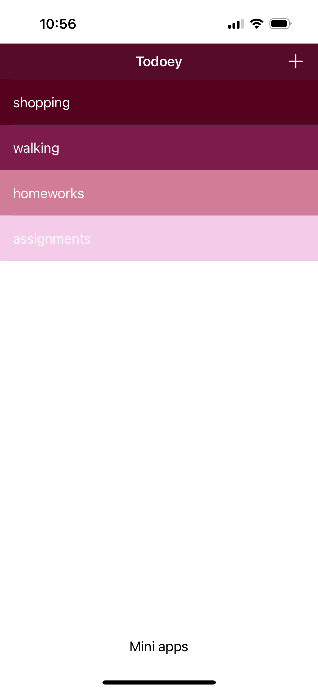
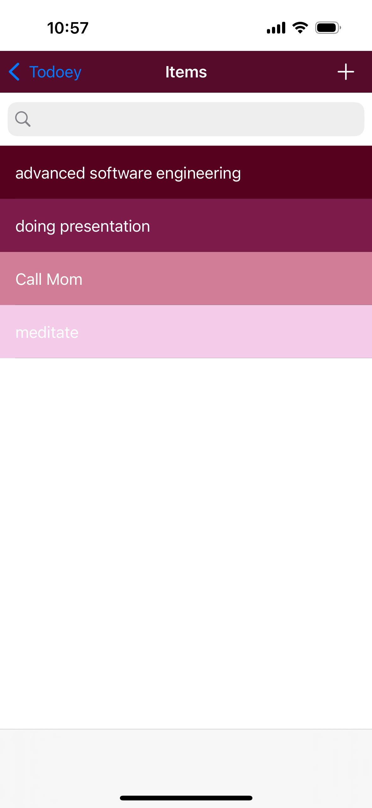

# Todoey UI & UX Design

## User Interface (UI) Principles

The UI design follows these principles:
- **Simplicity:** Clean, clutter-free design for ease of use.
- **Consistency:** Consistent color scheme and font choices across the app.
- **Accessibility:** Large, readable text and intuitive button placement.

### UI Components

1. **Home Screen:** Displays task categories with an add button.
   - Displays tasks within a selected category.
   - Search button to list up the task numbers starting with the letter you type first.
   - 
   - [Home Screen Video](videos/home_screen.mp4)

2. **Task List Screen:** Displays tasks within a selected category.
   - 
   - [Task List Screen Video](videos/task_list_screen.mp4)

3. **Task Details & Editing:** Allows users to set task priority and reminders.
   - 
   - [Task Details Video](videos/task_details.mp4)

## UX Enhancements

- **Swipe Gestures:** Users can swipe left to delete tasks or categories.
  - [Swipe Gestures Video](videos/swipe_gestures.mp4)

- **Drag & Drop:** Users can reorder tasks based on priority.
  - [Drag & Drop Video](videos/drag_drop.mp4)

- **Dark Mode Support:** For better readability at night.
  - [Dark Mode Video](videos/dark_mode.mp4)

- **Color Adaptation:** The color changes gently to match the user's mind calmness.
  - [Color Adaptation Video](videos/color_adaptation.mp4)
