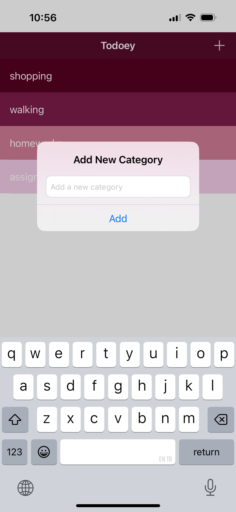
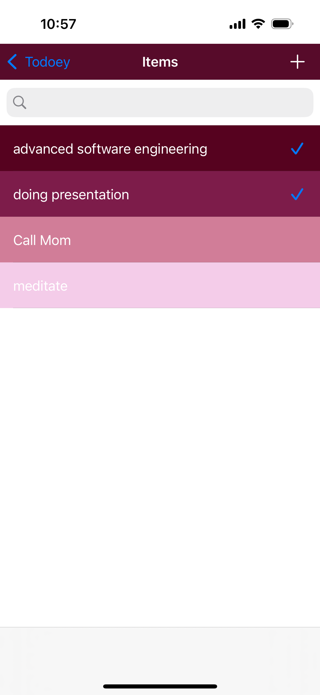
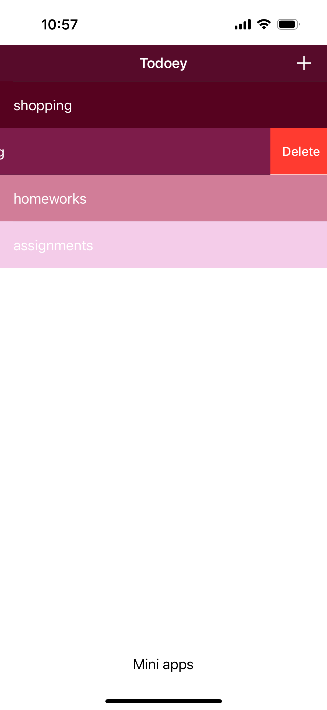
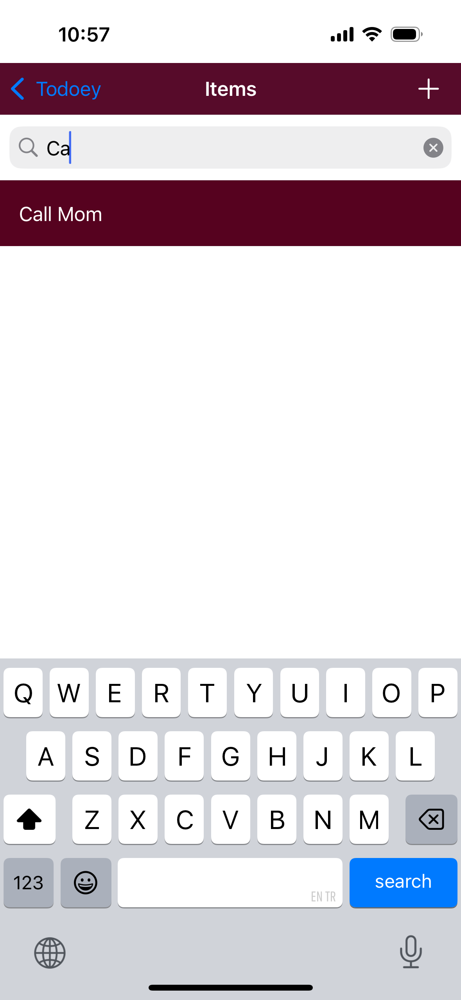
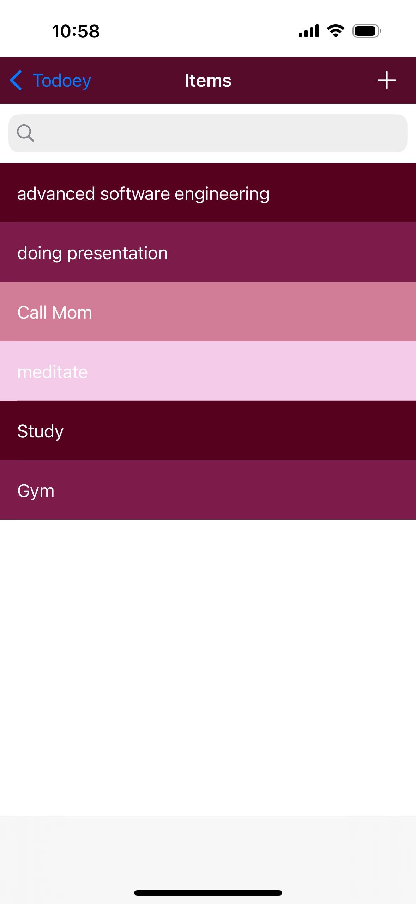
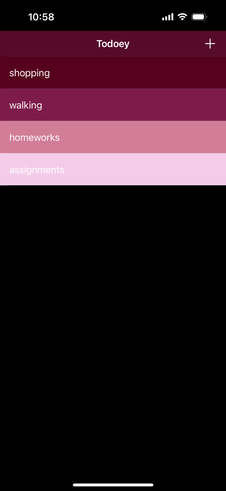

# UI & UX Design of Todoey  

## User Interface (UI) Principles  

The UI design follows these principles:  
- **Simplicity:** Clean, clutter-free design for ease of use.  
- **Consistency:** Consistent color scheme and font choices across the app.  
- **Accessibility:** Large, readable text and intuitive button placement.  

### UI Components  

1. **Home Screen:** Displays task categories with an add button.  
   - Home Screen picture and button + picture.  
     
     

2. **Task List Screen:** Displays tasks within a selected category.  
     

3. **Allow Users to Tick the Finished Tasks:** Users can mark tasks as completed by ticking a checkbox.  
     

## UX Enhancements  

- **Swipe and Delete:** Users can swipe left to delete tasks or categories.  
     

- **Search Button:** A search button to filter tasks starting with the letter typed.  
     

- **Color Adaptation:** The color changes gently to match the user's mind calmness.  
     

- **Dark Mode Support:** For better readability at night.  
     
